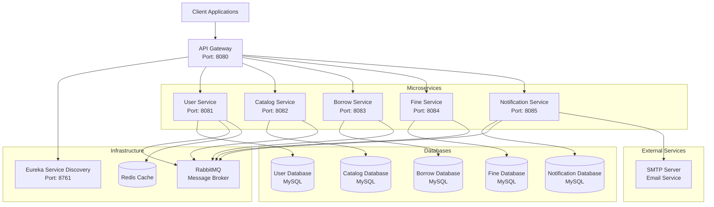
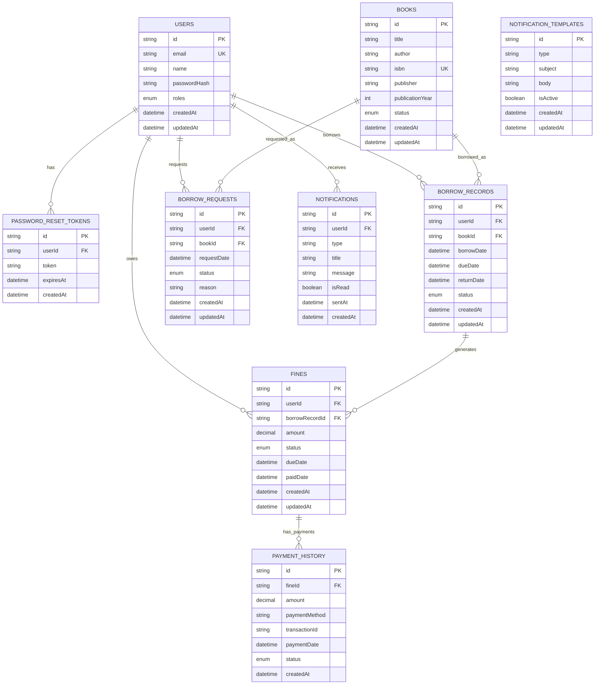

# Library Management System

A comprehensive microservices-based library management system built with Spring Boot, Spring Cloud, and modern architectural patterns.

## 🏗️ Architecture Overview

This system follows a microservices architecture with the following components:

- **Eureka Service Discovery** - Service registry and discovery
- **API Gateway** - Centralized routing and load balancing
- **User Service** - User management and authentication
- **Catalog Service** - Book catalog management
- **Borrow Service** - Book borrowing and lending
- **Fine Service** - Fine calculation and payment processing
- **Notification Service** - Email notifications and alerts

### High-Level Design Diagram



## 🚀 Quick Start

### Prerequisites

- Java 21+
- Maven 3.8+
- MySQL 8.0+
- RabbitMQ
- Redis (optional, for caching)

### Running the Services

1. **Start Eureka Service Discovery**
   ```bash
   cd eureka-service
   mvn spring-boot:run
   ```
   Access at: http://localhost:8761

2. **Start API Gateway**
   ```bash
   cd api-gateway
   mvn spring-boot:run
   ```
   Access at: http://localhost:8080

3. **Start User Service**
   ```bash
   cd user-service
   mvn spring-boot:run
   ```

4. **Start Other Services**
   ```bash
   # Catalog Service
   cd catalog-service && mvn spring-boot:run
   
   # Borrow Service
   cd borrow-service && mvn spring-boot:run
   
   # Fine Service
   cd fine-service && mvn spring-boot:run
   
   # Notification Service
   cd notification-service && mvn spring-boot:run
   ```

## 📚 API Documentation

### User Service APIs

**Base URL:** `http://localhost:8080/api/users` (via Gateway) or `http://localhost:8081/api` (direct)

#### Authentication Endpoints

| Method | Endpoint | Description | Authentication Required |
|--------|----------|-------------|------------------------|
| POST | `/auth/register` | Register new user | No |
| POST | `/auth/login` | Login and get JWT token | No |
| POST | `/auth/User-login` | Simple login (returns user details) | No |
| POST | `/auth/password/forgot` | Request password reset | No |
| POST | `/auth/password/reset` | Reset password with token | No |

#### Profile Management Endpoints

| Method | Endpoint | Description | Authentication Required |
|--------|----------|-------------|------------------------|
| GET | `/profile?email={email}` | Get user profile | Yes (JWT) |
| PUT | `/profile?email={email}&name={name}` | Update user profile | Yes (JWT) |

#### Request/Response Examples

**1. User Registration**
```bash
POST /api/users/auth/register
Content-Type: application/json

{
  "email": "user@example.com",
  "name": "John Doe",
  "password": "password123",
  "roles": ["USER"]
}
```

**Response:**
```json
{
  "id": "uuid",
  "email": "user@example.com",
  "name": "John Doe",
  "passwordHash": "$2a$10$...",
  "roles": ["USER"],
  "createdAt": "2025-10-28T18:20:31.527771Z"
}
```

**2. User Login (JWT)**
```bash
POST /api/users/auth/login
Content-Type: application/json

{
  "email": "user@example.com",
  "password": "password123"
}
```

**Response:**
```json
{
  "token": "eyJhbGciOiJIUzI1NiJ9..."
}
```

**3. Get User Profile (Authenticated)**
```bash
GET /api/users/profile?email=user@example.com
Authorization: Bearer <JWT_TOKEN>
```

**Response:**
```json
{
  "id": "uuid",
  "email": "user@example.com",
  "name": "John Doe",
  "passwordHash": "$2a$10$...",
  "roles": ["USER"],
  "createdAt": "2025-10-28T18:20:31.527771Z"
}
```

**4. Password Reset Request**
```bash
POST /api/users/auth/password/forgot?email=user@example.com
```

**Response:**
```json
{
  "resetToken": "uuid-token"
}
```

**5. Password Reset**
```bash
POST /api/users/auth/password/reset?token=uuid-token&newPassword=newpass123
```

**Response:**
```json
{
  "message": "Password successfully reset"
}
```

### Catalog Service APIs

**Base URL:** `http://localhost:8080/api/books` (via Gateway)

| Method | Endpoint | Description | Authentication Required |
|--------|----------|-------------|------------------------|
| GET | `/` | Get all books | No |
| GET | `/{id}` | Get book by ID | No |
| POST | `/` | Add new book | Yes (Librarian/Admin) |
| PUT | `/{id}` | Update book | Yes (Librarian/Admin) |
| DELETE | `/{id}` | Remove book | Yes (Librarian/Admin) |
| GET | `/search?query={query}` | Search books | No |

### Borrow Service APIs

**Base URL:** `http://localhost:8080/api/borrows` (via Gateway)

| Method | Endpoint | Description | Authentication Required |
|--------|----------|-------------|------------------------|
| POST | `/` | Request book borrowing | Yes (User) |
| GET | `/user/{userId}` | Get user's borrowings | Yes (User) |
| PUT | `/{id}/return` | Return book | Yes (User) |
| GET | `/overdue` | Get overdue books | Yes (Librarian/Admin) |

### Fine Service APIs

**Base URL:** `http://localhost:8080/api/fines` (via Gateway)

| Method | Endpoint | Description | Authentication Required |
|--------|----------|-------------|------------------------|
| GET | `/user/{userId}` | Get user's fines | Yes (User) |
| POST | `/calculate` | Calculate fines for overdue books | Yes (System) |
| POST | `/pay` | Process fine payment | Yes (User) |

### Notification Service APIs

**Base URL:** `http://localhost:8080/api/notifications` (via Gateway)

| Method | Endpoint | Description | Authentication Required |
|--------|----------|-------------|------------------------|
| POST | `/send` | Send notification | Yes (System) |
| GET | `/user/{userId}` | Get user notifications | Yes (User) |

## 🔐 Security

### Authentication
- JWT-based authentication
- Password encryption using BCrypt
- Role-based access control (USER, LIBRARIAN, ADMIN)

### Authorization
- Public endpoints: Registration, Login, Password Reset
- Protected endpoints: Profile management, Book operations
- Role-based access for administrative functions

## 📊 Database Schema

### Entity Relationship Diagram



### Database Details

#### User Service Database (userdb)
- **users** - User information and authentication
- **password_reset_tokens** - Password reset functionality

#### Catalog Service Database (catalogdb)
- **books** - Book catalog and metadata
- **book_status** - Book availability status

#### Borrow Service Database (borrowdb)
- **borrow_records** - Book borrowing history
- **borrow_requests** - Pending borrow requests

#### Fine Service Database (finedb)
- **fines** - Fine records and payments
- **payment_history** - Payment transaction history

#### Notification Service Database (notifdb)
- **notifications** - Notification records
- **notification_templates** - Email templates

## 🔄 Event-Driven Architecture

The system uses RabbitMQ for asynchronous communication:

### Events Published
- **User Events**: Registration, Password Reset, Profile Changes
- **Book Events**: Book Added, Updated, Removed
- **Borrow Events**: Borrow Requested, Approved, Returned, Overdue
- **Fine Events**: Fine Updated, Payment Requested, Payment Completed

### Event Routing
- All user events → `user.events.q`
- All book events → `catalog.events.q`
- All borrow events → `borrow.events.q`
- All fine events → `fine.events.q`

## 🚀 Deployment

### Docker Deployment (Optional)
```bash
# Build all services
mvn clean package

# Run with Docker Compose
docker-compose up -d
```

### Environment Variables
```bash
# Database Configuration
DB_HOST=localhost
DB_PORT=3306
DB_USERNAME=root
DB_PASSWORD=root

# RabbitMQ Configuration
RABBITMQ_HOST=localhost
RABBITMQ_PORT=5672

# Redis Configuration (Optional)
REDIS_HOST=localhost
REDIS_PORT=6379

# Email Configuration
EMAIL_USERNAME=your-email@gmail.com
EMAIL_PASSWORD=your-app-password
```

## 🧪 Testing

### Unit Tests
```bash
mvn test
```

### Integration Tests
```bash
mvn verify
```

### API Testing
Use the provided Postman collection or test with curl commands shown in the API documentation.

## 📈 Monitoring and Logging

- **Eureka Dashboard**: http://localhost:8761
- **API Gateway**: http://localhost:8080
- **Service Health**: Each service exposes health endpoints
- **Logging**: Structured logging with SLF4J and Logback

## 🔧 Configuration

### Service Ports
- Eureka Service: 8761
- API Gateway: 8080
- User Service: 8081
- Catalog Service: 8082
- Borrow Service: 8083
- Fine Service: 8084
- Notification Service: 8085

### Database Ports
- MySQL: 3306
- RabbitMQ: 5672
- Redis: 6379

## 🤝 Contributing

1. Fork the repository
2. Create a feature branch
3. Make your changes
4. Add tests
5. Submit a pull request

## 📄 License

This project is licensed under the MIT License - see the LICENSE file for details.

## 🆘 Support

For support and questions:
- Create an issue in the repository
- Contact the development team
- Check the documentation and API examples

---

**Note**: This is a comprehensive library management system designed for educational and demonstration purposes. For production use, additional security measures, monitoring, and scalability considerations should be implemented.
