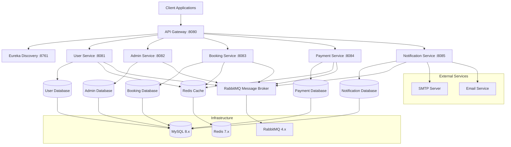
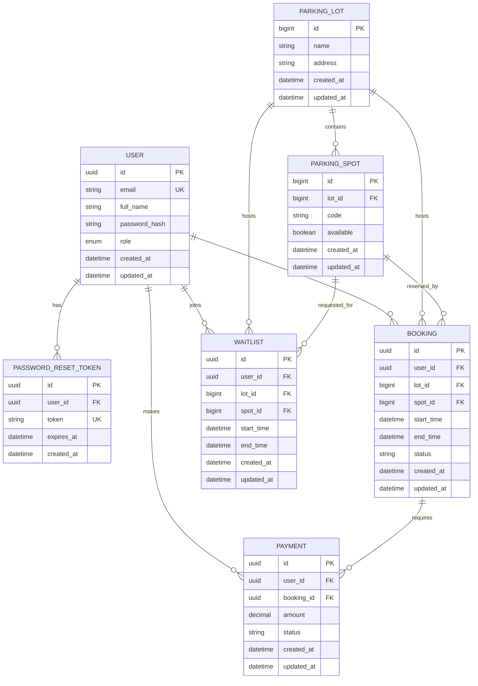

# Vehicle Parking Management System

A comprehensive microservices-based vehicle parking management system built with Spring Boot 3.3.3 and Java 21. The system provides complete functionality for managing parking lots, user accounts, bookings, payments, and notifications with proper layered architecture.

## 🏗️ Architecture Overview

The system follows a microservices architecture with proper separation of concerns:

- **Controller Layer**: Handles HTTP requests and responses
- **Service Layer**: Contains business logic and orchestration
- **Repository Layer**: Manages data persistence
- **Event-Driven Communication**: Asynchronous messaging via RabbitMQ
- **Caching**: Redis for performance optimization
- **Security**: JWT-based authentication with role-based access control

### High-Level Design (HLD)



### Entity Relationship (ER) Diagram



## 🚀 Services

| Service | Port | Description |
|---------|------|-------------|
| Discovery Service | 8761 | Eureka Server for service discovery |
| API Gateway | 8080 | Central entry point for all requests |
| User Service | 8081 | User management, authentication, profiles |
| Admin Service | 8082 | Parking lot and spot management |
| Booking Service | 8083 | Booking creation, management, waitlist |
| Payment Service | 8084 | Payment processing and tracking |
| Notification Service | 8085 | Email notifications and alerts |

## 🛠️ Technology Stack

- **Backend**: Spring Boot 3.3.3, Java 21
- **Database**: MySQL 8.x
- **Caching**: Redis 7.x
- **Message Broker**: RabbitMQ 4.x (Erlang 28.x)
- **Service Discovery**: Eureka
- **API Gateway**: Spring Cloud Gateway
- **Security**: JWT, BCrypt
- **Documentation**: Swagger/OpenAPI

## 📋 Prerequisites

1. **Java 21** installed
2. **MySQL 8.x** running locally
3. **Redis 7.x** running locally
4. **RabbitMQ 4.x** running locally (with Erlang 28.x)
5. **Maven 3.6+** for building

## 🚀 Quick Start

### 1. Database Setup
```sql
-- Create databases for each service
CREATE DATABASE user_service_db;
CREATE DATABASE admin_service_db;
CREATE DATABASE booking_service_db;
CREATE DATABASE payment_service_db;
CREATE DATABASE notification_service_db;
```

### 2. Configuration
Update `application.yml` in each service with your MySQL credentials:
```yaml
spring:
  datasource:
    username: your_username
    password: your_password
```

### 3. Start Services
Use the provided batch script or start manually:

**Windows:**
```bash
start-all-services.bat
```

**Manual Start Order:**
```bash
# Terminal 1 - Discovery Service
cd discovery-service && mvn spring-boot:run

# Terminal 2 - API Gateway (wait 10 seconds)
cd api-gateway && mvn spring-boot:run

# Terminal 3 - User Service (wait 5 seconds)
cd user-service && mvn spring-boot:run

# Terminal 4 - Admin Service (wait 5 seconds)
cd admin-service && mvn spring-boot:run

# Terminal 5 - Booking Service (wait 5 seconds)
cd booking-service && mvn spring-boot:run

# Terminal 6 - Payment Service (wait 5 seconds)
cd payment-service && mvn spring-boot:run

# Terminal 7 - Notification Service (wait 5 seconds)
cd notification-service && mvn spring-boot:run
```

## 📚 API Documentation

### 🔐 User Service (Port 8081)

**Base URL:** `http://localhost:8081`

#### Authentication Endpoints

| Method | Endpoint | Description | Auth Required |
|--------|----------|-------------|---------------|
| POST | `/api/auth/register` | Register new user | No |
| POST | `/api/auth/login` | User login | No |
| POST | `/api/auth/logout` | User logout | Yes |
| POST | `/api/auth/change-password` | Change password | Yes |
| POST | `/api/auth/forgot-password` | Request password reset | No |
| POST | `/api/auth/reset-password` | Reset password with token | No |

#### User Management Endpoints

| Method | Endpoint | Description | Auth Required |
|--------|----------|-------------|---------------|
| GET | `/api/users/me` | Get user profile | Yes |
| PUT | `/api/users/me` | Update user profile | Yes |

#### Request/Response Examples

**Register User:**
```json
POST /api/auth/register
{
  "fullName": "John Doe",
  "email": "john@example.com",
  "password": "password123",
  "role": "USER"
}
```

**Login:**
```json
POST /api/auth/login
{
  "email": "john@example.com",
  "password": "password123"
}
```

**Response:**
```json
{
  "token": "eyJhbGciOiJIUzI1NiIsInR5cCI6IkpXVCJ9..."
}
```

### 🏢 Admin Service (Port 8082)

**Base URL:** `http://localhost:8082`

#### Parking Lot Management

| Method | Endpoint | Description | Auth Required | Role |
|--------|----------|-------------|---------------|------|
| GET | `/api/lots` | Get all parking lots | Yes | ADMIN, LOT_MANAGER |
| POST | `/api/lots` | Create parking lot | Yes | ADMIN |
| PUT | `/api/lots/{id}` | Update parking lot | Yes | ADMIN |
| DELETE | `/api/lots/{id}` | Delete parking lot | Yes | ADMIN |

#### Parking Spot Management

| Method | Endpoint | Description | Auth Required | Role |
|--------|----------|-------------|---------------|------|
| POST | `/api/lots/{id}/spots` | Add spot to lot | Yes | ADMIN, LOT_MANAGER |
| PUT | `/api/lots/{lotId}/spots/{spotId}` | Update spot | Yes | ADMIN, LOT_MANAGER |
| DELETE | `/api/lots/{lotId}/spots/{spotId}` | Delete spot | Yes | ADMIN |
| GET | `/api/lots/{id}/spots` | Get available spots | Yes | ADMIN, LOT_MANAGER |
| GET | `/api/lots/{id}/spots/all` | Get all spots | Yes | ADMIN, LOT_MANAGER |

#### Request Examples

**Create Parking Lot:**
```json
POST /api/lots
{
  "name": "Downtown Parking",
  "address": "123 Main St, City"
}
```

**Add Parking Spot:**
```json
POST /api/lots/1/spots
{
  "code": "A-01",
  "available": true
}
```

### 📅 Booking Service (Port 8083)

**Base URL:** `http://localhost:8083`

#### Booking Management

| Method | Endpoint | Description | Auth Required |
|--------|----------|-------------|---------------|
| GET | `/api/bookings` | Get user bookings | Yes |
| GET | `/api/bookings/{id}` | Get specific booking | Yes |
| POST | `/api/bookings` | Create booking | Yes |
| PUT | `/api/bookings/{id}` | Update booking | Yes |
| DELETE | `/api/bookings/{id}` | Cancel booking | Yes |
| GET | `/api/bookings/past` | Get past bookings | Yes |
| GET | `/api/bookings/future` | Get future bookings | Yes |

#### Waitlist Management

| Method | Endpoint | Description | Auth Required |
|--------|----------|-------------|---------------|
| GET | `/api/bookings/waitlist` | Get user waitlist | Yes |
| POST | `/api/bookings/waitlist` | Add to waitlist | Yes |
| DELETE | `/api/bookings/waitlist/{id}` | Cancel waitlist entry | Yes |

#### Request Examples

**Create Booking:**
```json
POST /api/bookings
{
  "lotId": 1,
  "spotId": 1,
  "startTime": "2024-01-15T09:00:00",
  "endTime": "2024-01-15T17:00:00"
}
```

**Response (Success):**
```json
{
  "id": "123e4567-e89b-12d3-a456-426614174000",
  "userId": "456e7890-e89b-12d3-a456-426614174001",
  "lotId": 1,
  "spotId": 1,
  "startTime": "2024-01-15T09:00:00",
  "endTime": "2024-01-15T17:00:00",
  "status": "CREATED"
}
```

**Response (Waitlist):**
```json
{
  "message": "spot unavailable, added to waitlist",
  "waitlistId": "789e0123-e89b-12d3-a456-426614174002",
  "position": 3
}
```

### 💳 Payment Service (Port 8084)

**Base URL:** `http://localhost:8084`

#### Payment Management

| Method | Endpoint | Description | Auth Required | Role |
|--------|----------|-------------|---------------|------|
| POST | `/api/payments` | Initiate payment | Yes | - |
| POST | `/api/payments/{id}/confirm` | Confirm payment | Yes | - |
| POST | `/api/payments/{id}/fail` | Mark payment as failed | Yes | - |
| GET | `/api/payments` | Get user payments | Yes | - |
| GET | `/api/payments/booking/{bookingId}` | Get payments by booking | Yes | - |
| GET | `/api/payments/between` | Get payments by date range | Yes | - |
| GET | `/api/payments/status/{status}` | Get payments by status | Yes | - |

#### Admin Endpoints

| Method | Endpoint | Description | Auth Required | Role |
|--------|----------|-------------|---------------|------|
| GET | `/api/payments/admin/all` | Get all payments | Yes | ADMIN |
| GET | `/api/payments/admin/user/{userId}` | Get user payments (admin) | Yes | ADMIN |
| GET | `/api/payments/admin/status/{status}` | Get payments by status (admin) | Yes | ADMIN |
| POST | `/api/payments/cache/clear` | Clear payment cache | Yes | ADMIN |

#### Request Examples

**Initiate Payment:**
```json
POST /api/payments
{
  "bookingId": "123e4567-e89b-12d3-a456-426614174000",
  "amount": 25.50
}
```

**Confirm Payment:**
```json
POST /api/payments/123e4567-e89b-12d3-a456-426614174000/confirm
```

### 📧 Notification Service (Port 8085)

**Base URL:** `http://localhost:8085`

#### Notification Endpoints

| Method | Endpoint | Description | Auth Required |
|--------|----------|-------------|---------------|
| POST | `/api/notifications/email` | Send email notification | Yes |
| GET | `/api/notifications/status` | Get service status | No |

#### Request Examples

**Send Email:**
```json
POST /api/notifications/email
{
  "to": "user@example.com",
  "subject": "Booking Confirmation",
  "body": "Your parking booking has been confirmed."
}
```

## 🔧 Swagger Documentation

Access interactive API documentation at:
- **User Service**: http://localhost:8081/swagger-ui.html
- **Admin Service**: http://localhost:8082/swagger-ui.html
- **Booking Service**: http://localhost:8083/swagger-ui.html
- **Payment Service**: http://localhost:8084/swagger-ui.html
- **Notification Service**: http://localhost:8085/swagger-ui.html

## 🔄 System Flow

### 1. User Registration & Authentication
1. User registers via `/api/auth/register`
2. User logs in via `/api/auth/login` to get JWT token
3. JWT token used for authenticated requests

### 2. Parking Management (Admin/Lot Manager)
1. Admin creates parking lots via `/api/lots`
2. Admin/Lot Manager adds parking spots via `/api/lots/{id}/spots`
3. System tracks spot availability

### 3. Booking Process
1. User creates booking via `/api/bookings`
2. System checks availability and creates booking or adds to waitlist
3. Booking events published to message queue

### 4. Payment Processing
1. Payment initiated via `/api/payments`
2. Payment confirmed via `/api/payments/{id}/confirm`
3. Payment status events published to message queue

### 5. Notifications
1. Notification service listens to events
2. Sends appropriate emails based on event type
3. Logs all notification activities

## ⚙️ Schedulers

The system includes several scheduled tasks:

- **Booking Cleanup**: Expires old CREATED bookings (every 15 minutes)
- **Payment Reconciliation**: Expires PENDING payments > 2 hours (every 30 minutes)
- **Admin Reporting**: Generates hourly occupancy reports
- **Notification Reminders**: Daily reminder processing (9 AM)

## 🔒 Security Features

- **JWT Authentication**: Secure token-based authentication
- **Role-Based Access Control**: USER, ADMIN, LOT_MANAGER roles
- **Password Security**: BCrypt hashing
- **Token Blacklisting**: Secure logout functionality
- **Input Validation**: Comprehensive request validation

## 🚀 Advanced Features

### Event-Driven Architecture
- **RabbitMQ Integration**: Asynchronous communication
- **Event Publishing**: Service-to-service communication
- **Event Listening**: Reactive event processing

### Caching Strategy
- **Redis Integration**: High-performance caching
- **Profile Caching**: User profile data caching
- **Availability Caching**: Spot availability caching
- **Payment Caching**: Payment data caching

### Waitlist Management
- **Automatic Waitlist**: When spots unavailable
- **Waitlist Processing**: Automatic promotion when spots free up
- **Position Tracking**: User waitlist position

## 🐛 Troubleshooting

### Common Issues

1. **Service Discovery Issues**
   - Ensure Eureka server is running first
   - Check service registration in Eureka dashboard

2. **Database Connection Issues**
   - Verify MySQL is running
   - Check database credentials in application.yml

3. **RabbitMQ Connection Issues**
   - Ensure RabbitMQ is running
   - Check RabbitMQ management interface

4. **Redis Connection Issues**
   - Verify Redis is running
   - Check Redis connection settings

### Logs
Check application logs for detailed error information:
```bash
tail -f logs/application.log
```

## 📊 Monitoring

- **Eureka Dashboard**: http://localhost:8761
- **RabbitMQ Management**: http://localhost:15672 (guest/guest)
- **Redis CLI**: `redis-cli` for cache inspection

## 🤝 Contributing

1. Fork the repository
2. Create a feature branch
3. Make your changes
4. Add tests if applicable
5. Submit a pull request

## 📄 License

This project is licensed under the MIT License.
